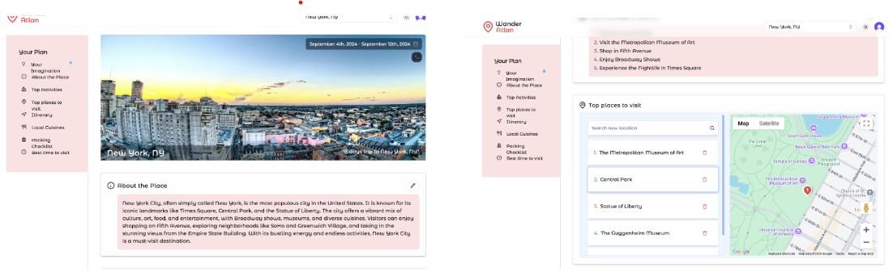
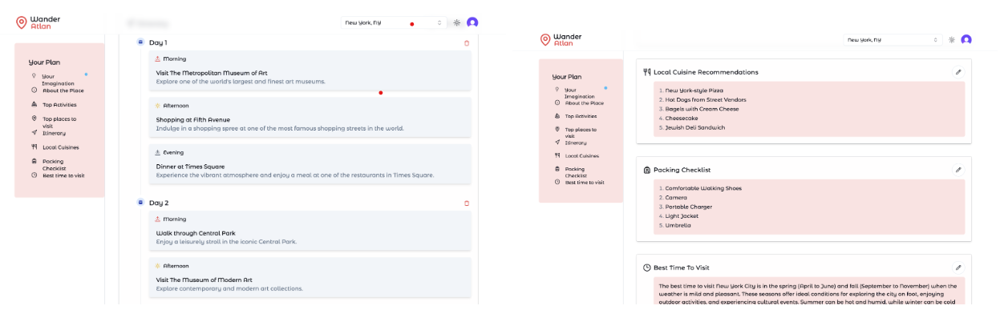
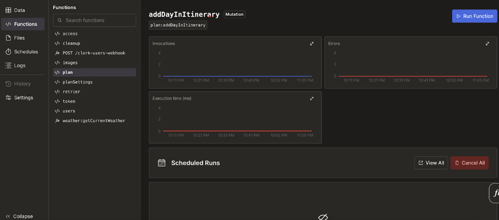
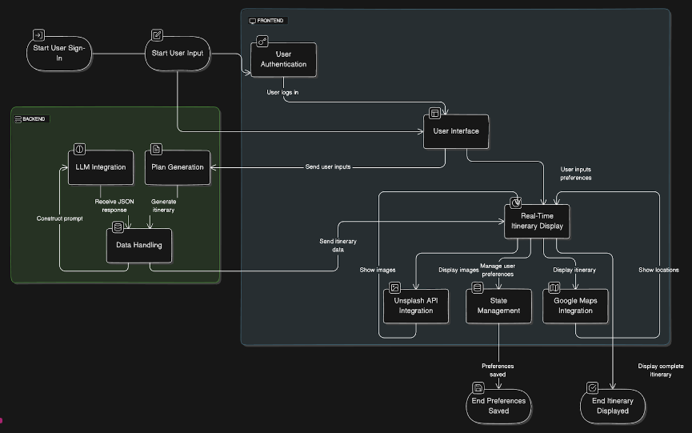

# Wander-Atlan Personalized Travel Itinerary
## Overview
Wander-Atlan is a cutting-edge travel planning application that offers a personalized and flexible itinerary generation experience. Leveraging advanced technologies, user-centric design, and AI-driven recommendations, Wander-Atlan makes travel planning seamless and enjoyable.




## Key Features
1. User Authentication: Secure sign-in options using Clerk, supporting Google and GitHub accounts.
2. Real-Time Itinerary Display: Dynamic, AI-generated itineraries from OpenAI’s GPT-3.5 based on user inputs.
3. Interactive Mapping: Integration with Google Maps API to visualize routes and destinations.
4. Visual Content Integration: High-quality images from Unsplash to enhance the travel experience.
5. Customizable Itineraries: Users can edit AI-generated plans or create itineraries from scratch.
## Technologies Used
### Frontend
- Framework: Built with React.js and Next.js for a modern web experience.
- Styling: Utilizes TailwindCSS for a responsive and sleek design.
- State Management: Efficiently managed with React hooks.


### Backend
- Serverless Backend: Powered by Convex, managing data flow and API interactions.
- AI Integration: Communicates with OpenAI’s GPT-3.5 for itinerary generation.
- API Management: Handles requests to Google Maps and Unsplash seamlessly.


### User Experience
- Sign In: Users log in via Clerk using their Google or GitHub accounts.
- Input Trip Details: Users enter destination, travel dates, and preferred activities.
- Itinerary Generation: AI generates a customized itinerary with activities, packing lists, and local insights.
- Edit Itinerary: Users can manually adjust activities and time slots to their liking.
- Mapping & Visuals: Integrated Google Maps displays routes and destinations, accompanied by stunning imagery from Unsplash.
## Challenges and Solutions
- API Integration: Optimized multiple API calls for performance and response times through caching.
- Dynamic Data Rendering: Implemented React hooks to manage real-time state updates effectively.
- Google Maps API Integration: Enhanced syncing of location services with autocomplete and place search features.
- Authentication Flow: Streamlined multi-provider OAuth using Clerk’s secure features.
## Getting Started
To run the application locally, follow these steps:

Clone the repository:

```bash 
git clone https://github.com/your-repo/wander-atlan.git
cd wander-atlan
```
Install dependencies:

```bash
npm install
```

Set up environment variables for API keys (OpenAI, Google Maps, Unsplash):

```bash
cp .env.example .env
```
Start the development server:

```bash
npm run dev
```
Visit http://localhost:3000 in your browser.